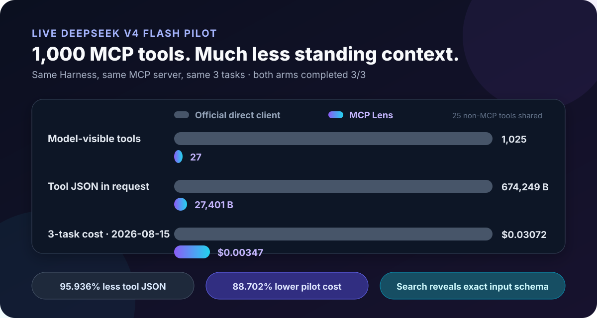

# MCP Lens for DeepSeek Harness

English | [简体中文](README.zh-CN.md)

[](https://github.com/labmimors/dsh-mcp-lens/actions/workflows/verify.yml)
[](https://github.com/labmimors/dsh-mcp-lens/releases)
[](LICENSE)
[](https://github.com/deepseek-ai/deepseek-harness)

**Cut the context and API cost of large MCP catalogs.**

MCP Lens lets DeepSeek Harness search and call 1,000 remote tools through two stable model-facing interfaces. Instead of sending every tool schema on every turn, it reveals exact schemas for a small ranked set only when a tool is needed.

At a glance:

- Spend less standing context on large MCP catalogs: the live three-task pilot reduced `request/header.tools` JSON from `674,249 B` to `27,401 B`.
- Lower input-heavy API spend in the tested setup: the same pilot's estimated V4 Flash cost fell from `$0.0307204` to `$0.0034707`.
- Keep task quality grounded in evidence: both arms completed `3/3` tested tasks, rather than trading reach for a synthetic win.
- Narrow tool-choice drift and risk: the model sees exact schemas only for ranked matches, while `allowTools` and `denyTools` gate the final `server/tool`.

Try the [local-only catalog calculator](https://labmimors.github.io/dsh-mcp-lens/) to measure your current tool-schema bytes in the browser and generate a shareable comparison card. Prefer a repeatable CI guard? Use the [schema budget Action](#keep-schema-drift-out-of-ci) to fail a workflow when tool count or schema bytes drift above your limit.

Need the same measurement in CI? This repository also ships a dependency-free GitHub Action that audits a checked-in tool payload and reports the model-facing tool count, canonical schema bytes, and byte reduction versus the fixed two-tool Lens surface.

```yaml
- uses: labmimors/dsh-mcp-lens@main
  with:
    tools-file: fixtures/request-header-tools.json
```

Pin a reviewed commit SHA or the next release tag once this action ships in a tagged release.

<p align="center">
  
</p>

**Why does the chart show 27 instead of 2?** Both arms include the same 25 non-MCP Harness tools: the direct client exposes `25 + 1,000 = 1,025` total tools; Lens exposes `25 + 2 = 27`. The MCP surface itself is **1,000 → 2**.

## What it solves

| Your problem | What MCP Lens changes |
|---|---|
| **API input grows with every MCP tool** | The MCP surface always starts with only `mcp_search` and `mcp_call`. In our live three-task pilot, estimated V4 Flash cost fell **88.702%**. |
| **Large tool lists consume standing context** | With the same 1,000-tool server, complete Harness request-tool JSON fell from **674,249 B to 27,401 B**. |
| **You worry routing will reduce task completion** | In the tested customer, Chinese-ticket, and GitHub tasks, Lens and the direct client both completed **3/3** with correct arguments and results. |
| **Many similar tools widen the choice set** | Search narrows what the model sees at once, returns exact `inputSchema` values, and calls an explicit `server/tool` identity. |
| **Every server connects even when unused** | Connections are lazy. Activation starts no MCP process and opens no MCP socket. |
| **One server outage should not block the rest** | Other servers keep working, and Lens keeps the previous usable catalog when a refresh fails. |
| **Risky tools should be hidden by default** | No remote tool appears until it matches `allowTools`; `denyTools` always wins in search and calls. |

In the live pilot, MCP Lens and the official direct client both completed **3/3 tasks**. Lens used one extra search step and more output tokens, so it is designed for large, multi-server, or long-tail catalogs—not a handful of tools used on every turn. See the [full pilot report](docs/LIVE_DEEPSEEK_PILOT.md).

## Install in 30 seconds

Prerequisites: DeepSeek Harness `0.1.0-rc.6`, Node.js `^22.19.0` or `>=24.0.0`, and `pnpm` on `PATH`. The `dsh plugin` command delegates installation to pnpm.

Install the prebuilt release into your Harness profile:

```sh
dsh plugin --profile web add https://github.com/labmimors/dsh-mcp-lens/releases/download/v0.1.0-rc.5/dsh-mcp-lens-0.1.0-rc.5.tgz
```

The tarball is already built, so no dependency build permission is needed. The MCP documentation server used below requires no additional API key; Harness still needs your configured model provider.

<details>
<summary>Install reviewed source instead</summary>

```sh
dsh plugin --profile web add github:labmimors/dsh-mcp-lens#v0.1.0-rc.5
```

Git installs fetch source and run `prepare`. With pnpm 10+, add this exact package key to `$DSH_HOME/profiles/web/pnpm-workspace.yaml` (default `~/.dsh/profiles/web/pnpm-workspace.yaml`), then rerun the command:

```yaml
allowBuilds:
  dsh-mcp-lens: true
```

Review the source and pin a tag or commit SHA before granting build permission.

</details>

## Connect your first MCP server

The plugin ships with no servers and allows no remote tools until you opt in. Open:

```text
$DSH_HOME/profiles/web/cordis.patch.yml
```

If `DSH_HOME` is unset, the default path is `~/.dsh/profiles/web/cordis.patch.yml`. If the file contains only `[]`, replace `[]` with the block below. If it already contains `- id` entries, append this as another top-level list item. It connects the public [official MCP documentation server](https://modelcontextprotocol.io/mcp) but exposes only its two read-only query tools:

```yaml
- id: mcp-lens
  config:
    servers:
      - name: mcp-docs
        transport: streamable-http
        url: https://modelcontextprotocol.io/mcp

    cachePath: !!js dshHomePath('mcp-lens/catalog.json')
    allowTools:
      - mcp-docs/search_model_context_protocol
      - mcp-docs/query_docs_filesystem_model_context_protocol
    denyTools: ['mcp-docs/submit_feedback']
```

Verify the assembled profile, then start Harness:

```sh
dsh --profile web --dump-config
dsh --profile web
```

Now ask a normal question:

```text
Use the official MCP documentation server to explain when an MCP client should use Streamable HTTP.
```

MCP Lens handles the two-step routing internally:

```text
your request
  → mcp_search("search MCP documentation for Streamable HTTP")
  → exact mcp-docs/search_model_context_protocol input schema
  → mcp_call("mcp-docs", "search_model_context_protocol", arguments)
  → tool result
```

You do not have to mention `mcp_search` or `mcp_call` in normal prompts.

<details>
<summary>Authenticated Streamable HTTP example</summary>

```yaml
- id: mcp-lens
  config:
    servers:
      - name: knowledge
        transport: streamable-http
        url: https://mcp.example.com/rpc
        headers:
          Authorization: !!js '`Bearer ${process.env.MCP_TOKEN}`'
        cacheNamespace: knowledge-acme-readonly

    cachePath: !!js dshHomePath('mcp-lens/catalog.json')
    allowTools: ['knowledge/read_*', 'knowledge/search_*']
    denyTools: ['*/delete_*', '*/destroy_*']
```

`cacheNamespace` is a non-secret identity for one tenant and permission scope. Rotate it when the account or scope changes. Never put the credential itself in this field. If a credentialed server omits it, Lens keeps that catalog memory-only and rediscovers it after restart.

</details>

Patterns match the exact `server/tool` identity, support literals plus `*`, and apply with **deny winning**. An empty `allowTools` list allows nothing. A later Cordis patch replaces this row's whole `config`, so include every non-default field you want to keep.

## Is MCP Lens right for you?

| Choose | When it fits best |
|---|---|
| Official `@deepseek-ai/dsh-mcp-client` | You have a few stable tools that are used on most turns and want the simplest direct path. |
| MCP Lens | You have dozens to thousands of tools, several MCP servers, long-tail capabilities, or repeated context/cost pressure. |

Lens trades a search step on first use for a nearly constant standing MCP schema surface. The larger and less frequently used your catalog is, the stronger that trade becomes.

**Speed:** there is no universal latency win to claim. The first uncached use adds search and connection work; smaller requests may offset that cost on large catalogs, so measure your own workload.

## Measured results

### Live DeepSeek V4 Flash pilot

Same DeepSeek Harness `0.1.0-rc.6`, same 1,000-tool stdio server, and the same three customer/ticket/GitHub tasks:

| Metric across three tasks | Official direct client | MCP Lens | Difference |
|---|---:|---:|---:|
| Completed tasks | 3 / 3 | 3 / 3 | Tie |
| Model-visible tools per request | 1,025 | 27 | 97.366% fewer |
| `request/header.tools` JSON | 674,249 B | 27,401 B | 95.936% smaller |
| Uncached input tokens | 199,751 | 21,713 | 89.130% fewer |
| Cache-read input tokens | 934,912 | 74,496 | 92.032% fewer |
| Estimated API cost | $0.0307204 | $0.0034707 | 88.702% lower |

The cost estimate multiplies provider-reported usage by the [official DeepSeek V4 Flash pricing](https://api-docs.deepseek.com/quick_start/pricing/) retrieved on August 14, 2026. That pricing page also announces a new peak/off-peak schedule effective at 16:00 UTC on August 16, 2026, so later comparisons should recompute from the recorded usage. The three-task setup, observed calls, formula, and tradeoffs are recorded in [`docs/LIVE_DEEPSEEK_PILOT.md`](docs/LIVE_DEEPSEEK_PILOT.md).

### Keyless component benchmark

The checked-in benchmark uses a real Harness `Context`, `SystemPrompt`, and `ToolRuntime`, the official direct client as baseline, and the same local MCP fixture for both arms:

| Remote MCP tools | Direct-client schema JSON | Lens schema JSON | Reduction |
|---:|---:|---:|---:|
| 12 | 4,862 B | 1,114 B | 77.088% |
| 100 | 62,062 B | 1,114 B | 98.205% |
| 1,000 | 647,962 B | 1,114 B | 99.828% |

At 1,000 tools, the official client registers 1,000 remote schemas while Lens still registers two. On the frozen 12-query retrieval fixture, Lens measured Recall@1 / Recall@5 / MRR = `1.0 / 1.0 / 1.0`.

Reproduce the component result without an API key:

```sh
npm ci
npm run verify
npm run bench -- --output benchmark.json
```

The exact metric, fixture, dependency versions, source digest, and measurement limits are in [`benchmark/README.md`](benchmark/README.md).

## Keep schema drift out of CI

The dependency-free **MCP Lens Schema Audit** GitHub Action measures an exported model-facing tool payload inside the runner. It makes no network request, writes only numeric outputs, and never copies tool names, descriptions, or schemas into the Step Summary. Optional budgets turn an unexpected schema expansion into a failing check.

Accepted JSON shapes are a tool array, `{ "tools": [...] }`, `{ "schemas": [...] }`, or a recorded `{ "request": { "header": { "tools": [...] } } }` payload.

```yaml
name: MCP schema budget
on: [pull_request]

permissions:
  contents: read

jobs:
  audit:
    runs-on: ubuntu-latest
    steps:
      - uses: actions/checkout@fbc6f3992d24b796d5a048ff273f7fcc4a7b6c09 # v5
      - uses: labmimors/dsh-mcp-lens@6a7e006fd63887fecf2ce1e70a54af26e0df1378
        with:
          tools-file: artifacts/request-header.json
          max-tools: 100
          max-schema-bytes: 65536
```

The action accepts files up to 64 MiB, resolves the input inside `GITHUB_WORKSPACE`, and rejects symlink escapes. The byte metric is canonical `JSON.stringify(tools)` UTF-8 size—not tokens, billing, latency, or task quality.

## Reliability and resource controls

- **Lazy by default:** no MCP process or socket at plugin activation; idle connections close automatically.
- **Failure isolation:** catalog refreshes run per server; one failure does not hide healthy servers.
- **Last-good behavior:** failed or oversized discovery never replaces a usable catalog generation.
- **Bounded input:** deadlines and caps cover pagination, tool count, per-tool bytes, total catalog bytes, cursors, and streamed HTTP responses.
- **Credential-aware cache:** the owner-only `0600` cache stores projected tool metadata, never explicit env/header values or URL credentials.
- **Exact policy:** search and call share the same allow/deny decision at the final `server/tool` identity.
- **Clean shutdown:** cancellation, HMR, and disposal close transports, children, timers, and in-flight work.

MCP Lens is not a sandbox: stdio servers execute on the host, and HTTP servers receive the headers you configure. The current release bridges MCP Tools; it does not implement OAuth, Resources, Prompts, Elicitation, or task-based tool execution.

## Configuration reference

Most users only need `servers`, `cachePath`, `allowTools`, and `denyTools`. The remaining fields already have bounded defaults:

<details>
<summary>Show all bounded defaults</summary>

| Field | Default | Purpose |
|---|---:|---|
| `catalogTtlMs` | `86400000` | Refresh a catalog after 24 hours |
| `idleDisconnectMs` | `300000` | Close an idle server after 5 minutes |
| `connectTimeoutMs` | `30000` | Connection deadline |
| `callTimeoutMs` | `60000` | Tool-call deadline |
| `discoveryTimeoutMs` | `30000` | Whole paginated discovery deadline |
| `maxDiscoveryPages` | `1000` | Maximum pages per discovery |
| `maxToolsPerServer` | `10000` | Maximum tools accepted from one server |
| `maxBytesPerTool` | `1048576` | Maximum projected metadata bytes per tool |
| `maxTotalCatalogBytes` | `67108864` | Maximum total catalog/cache bytes |
| `maxHttpResponseBytes` | `16777216` | Maximum streamed HTTP response bytes |
| `maxCursorBytes` | `4096` | Maximum UTF-8 pagination cursor bytes |
| `searchLimitDefault` | `5` | Default search results |
| `searchLimitMax` | `10` | Maximum search results |

See the shipped [`cordis.patch.yml`](cordis.patch.yml) for the canonical defaults.

</details>

## Security, development, and community

- Useful on your catalog? [Star the repository](https://github.com/labmimors/dsh-mcp-lens) and [join the catalog challenge](https://github.com/labmimors/dsh-mcp-lens/discussions/11); sanitized real workloads help the next user decide.
- Want a quick before/after number? Use the [local-only catalog calculator](https://labmimors.github.io/dsh-mcp-lens/) to paste your current tool surface, compute exact UTF-8 bytes, and export a shareable card without uploading your schemas.
- End-user terms: [`EULA.md`](EULA.md).
- Privacy and data handling: [`PRIVACY.md`](PRIVACY.md).
- Support and response targets: [`SUPPORT.md`](SUPPORT.md).
- Security reports: read [`SECURITY.md`](SECURITY.md); do not disclose an unpatched exploit in a public issue.
- Contributions: read [`CONTRIBUTING.md`](CONTRIBUTING.md).
- Search quality: [submit a sanitized search miss](https://github.com/labmimors/dsh-mcp-lens/issues/new?template=search_miss.yml) and help turn it into a regression fixture.
- Release: [`v0.1.0-rc.5`](https://github.com/labmimors/dsh-mcp-lens/releases/tag/v0.1.0-rc.5).

DeepSeek Harness currently discovers community plugins through public GitHub repositories with the [`dsh-plugin`](https://github.com/topics/dsh-plugin) topic and installs them from GitHub, tarballs, or npm packages. See the official [plugin publishing guide](https://github.com/deepseek-ai/deepseek-harness/blob/master/docs/user/develop/basic/publish.md).

MCP Lens is an independent MIT-licensed community plugin and is not affiliated with or endorsed by DeepSeek AI.
