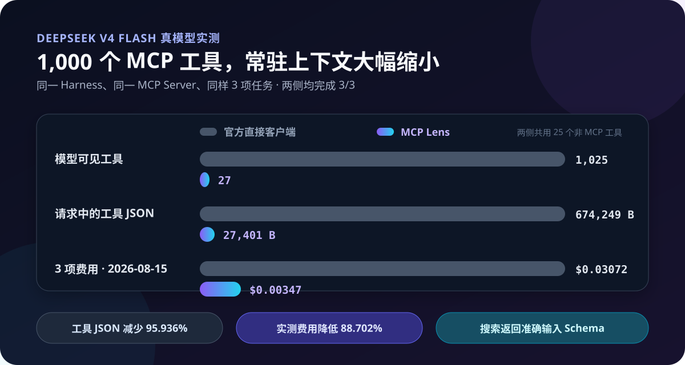

# DeepSeek Harness 的 MCP Lens

[English](README.md) | 简体中文

[](https://github.com/labmimors/dsh-mcp-lens/actions/workflows/verify.yml)
[](https://github.com/labmimors/dsh-mcp-lens/releases)
[](LICENSE)
[](https://github.com/deepseek-ai/deepseek-harness)

**让大型 MCP 工具库少占上下文、少花 API 费用。**

MCP Lens 让 DeepSeek Harness 通过两个稳定入口搜索并调用 1,000 个远端工具。它不会在每轮请求中塞入全部工具 Schema，而是只在需要工具时，为少量排序候选揭示准确 Schema。

先看结果：

- 大型 MCP 工具库常驻上下文更小：三项任务实测里，`request/header.tools` JSON 从 `674,249 B` 降到 `27,401 B`。
- 输入成本压力更低：同一组样本里，V4 Flash 预估费用从 `$0.0307204` 降到 `$0.0034707`。
- 完成率没有靠“缩能力”换出来：两侧都完成了 `3/3` 个已测任务。
- 工具偏移和风险更可控：模型只会看到排序候选的准确 Schema，而最终 `server/tool` 仍受 `allowTools` / `denyTools` 限制。

可以直接试试[本地目录测量页](https://labmimors.github.io/dsh-mcp-lens/)：把你当前的工具 Schema 粘进去，浏览器会本地计算准确 UTF-8 bytes，并生成可分享的对比卡片。

<p align="center">
  
</p>

**为什么图中是 27，而不是 2？** 两侧都包含同样的 25 个非 MCP Harness 工具：直接客户端是 `25 + 1,000 = 1,025` 个完整工具，Lens 是 `25 + 2 = 27` 个。MCP 工具面本身是 **1,000 → 2**。

## 它具体解决什么问题

| 你的问题 | MCP Lens 带来的改变 |
|---|---|
| **MCP 工具越多，每轮 API 输入越大** | MCP 工具面初始只有 `mcp_search` 和 `mcp_call`。在三任务实测中，V4 Flash 预估费用降低 **88.702%**。 |
| **大段工具定义长期挤占上下文** | 同一个 1,000 工具 Server 下，Harness 完整请求中的工具 JSON 从 **674,249 B 降至 27,401 B**。 |
| **担心压缩工具面会牺牲任务完成率** | 在已测的客户、中文工单和 GitHub 任务中，Lens 与直接客户端都以正确参数和结果完成 **3/3**。 |
| **大量相似工具会扩大单次候选暴露面** | 先缩小模型一次看到的候选集合并返回准确 `inputSchema`，再按明确的 `server/tool` 身份调用。 |
| **没有用到的 Server 也消耗连接资源** | 连接按需建立；插件激活时不启动 MCP 进程，也不打开 MCP Socket。 |
| **一个 Server 故障不应该阻塞其他 Server** | 其他 Server 会继续工作；刷新失败时仍保留上一份可用目录。 |
| **危险工具应该默认不可见** | 远端工具只有匹配 `allowTools` 才会出现；`denyTools` 在搜索和调用中永远优先。 |

在 DeepSeek 实测中，MCP Lens 和官方直接客户端都完成了 **3/3 项任务**。Lens 会多一次搜索，并在这组样本中产生更多输出 Token，因此它针对的是大型、多 Server、长尾工具库，而不是每轮都会用到的几个固定工具。完整数据见[中文实测报告](docs/LIVE_DEEPSEEK_PILOT.zh-CN.md)。

## 30 秒安装

前置要求：DeepSeek Harness `0.1.0-rc.6`、Node.js `^22.19.0` 或 `>=24.0.0`，并且 `pnpm` 已在 `PATH` 中。`dsh plugin` 会把安装交给 pnpm 执行。

把预编译 Release 安装到 Harness Profile：

```sh
dsh plugin --profile web add https://github.com/labmimors/dsh-mcp-lens/releases/download/v0.1.0-rc.3/dsh-mcp-lens-0.1.0-rc.3.tgz
```

这个 tarball 已完成构建，不需要依赖构建权限。下面使用的 MCP 文档 Server 不需要额外 API Key；Harness 仍然需要你已经配置好的模型 Provider。

<details>
<summary>改为安装已审核的源码</summary>

```sh
dsh plugin --profile web add github:labmimors/dsh-mcp-lens#v0.1.0-rc.3
```

Git 安装会下载源码并运行 `prepare`。使用 pnpm 10+ 时，请在 `$DSH_HOME/profiles/web/pnpm-workspace.yaml`（默认 `~/.dsh/profiles/web/pnpm-workspace.yaml`）中加入准确包名，然后重新安装：

```yaml
allowBuilds:
  dsh-mcp-lens: true
```

授予构建权限前请先审查源码，并固定 Tag 或 Commit SHA。

</details>

## 连接第一个 MCP Server

插件默认不携带 Server，也不会开放任何远端工具。打开：

```text
$DSH_HOME/profiles/web/cordis.patch.yml
```

如果没有设置 `DSH_HOME`，默认路径是 `~/.dsh/profiles/web/cordis.patch.yml`。如果文件内容只有 `[]`，请用下面的配置块替换 `[]`；如果已经存在其他 `- id` 项，请把它追加为另一个顶层列表项。它会连接公开的[官方 MCP 文档 Server](https://modelcontextprotocol.io/mcp)，但只开放其中两个只读查询工具：

```yaml
- id: mcp-lens
  config:
    servers:
      - name: mcp-docs
        transport: streamable-http
        url: https://modelcontextprotocol.io/mcp

    cachePath: !!js dshHomePath('mcp-lens/catalog.json')
    allowTools:
      - mcp-docs/search_model_context_protocol
      - mcp-docs/query_docs_filesystem_model_context_protocol
    denyTools: ['mcp-docs/submit_feedback']
```

先检查最终组装的 Profile，再启动 Harness：

```sh
dsh --profile web --dump-config
dsh --profile web
```

现在像平时一样提问：

```text
使用官方 MCP 文档 Server，解释 MCP Client 应该在什么情况下使用 Streamable HTTP。
```

MCP Lens 会在内部完成两段式路由：

```text
你的请求
  → mcp_search("搜索 MCP 文档中的 Streamable HTTP")
  → mcp-docs/search_model_context_protocol 的准确输入 Schema
  → mcp_call("mcp-docs", "search_model_context_protocol", arguments)
  → 工具结果
```

正常使用时，你不需要在 Prompt 中提到 `mcp_search` 或 `mcp_call`。

<details>
<summary>带身份验证的 Streamable HTTP 示例</summary>

```yaml
- id: mcp-lens
  config:
    servers:
      - name: knowledge
        transport: streamable-http
        url: https://mcp.example.com/rpc
        headers:
          Authorization: !!js '`Bearer ${process.env.MCP_TOKEN}`'
        cacheNamespace: knowledge-acme-readonly

    cachePath: !!js dshHomePath('mcp-lens/catalog.json')
    allowTools: ['knowledge/read_*', 'knowledge/search_*']
    denyTools: ['*/delete_*', '*/destroy_*']
```

`cacheNamespace` 是某个租户和权限范围的非秘密身份。切换账户或权限范围时需要轮换它，绝不能把真实凭据写入其中。带凭据的 Server 如果没有设置它，Lens 只在内存保存该目录，并在重启后重新发现。

</details>

模式匹配准确的 `server/tool` 身份，只支持字面量和 `*`，并且 **deny 永远优先**。空的 `allowTools` 不允许任何工具。后续 Cordis Patch 会替换这一行的整个 `config`，因此需要保留的非默认字段都要写在覆盖层里。

## 什么时候应该用它

| 选择 | 最适合的情况 |
|---|---|
| 官方 `@deepseek-ai/dsh-mcp-client` | 只有几个稳定工具，而且大多数轮次都会使用；你希望路径最直接。 |
| MCP Lens | 有几十到几千个工具、多个 MCP Server、很多长尾能力，或上下文与 API 成本已经成为问题。 |

Lens 用首次使用时的一次搜索，换取接近恒定的常驻 MCP Schema 面。工具越多、单个工具使用频率越低，这个交换越划算。

**速度：**目前没有可以普遍承诺的延迟提升。首次未缓存使用会增加搜索和连接工作；大型工具库的较小请求可能抵消这部分开销，请以自己的工作负载实测。

## 实测结果

### DeepSeek V4 Flash 真模型实测

同一个 DeepSeek Harness `0.1.0-rc.6`、同一个 1,000 工具 stdio Server、同样三项客户／工单／GitHub 任务：

| 三项任务合计 | 官方直接客户端 | MCP Lens | 差异 |
|---|---:|---:|---:|
| 完成任务 | 3 / 3 | 3 / 3 | 相同 |
| 每次请求中模型可见工具 | 1,025 | 27 | 减少 97.366% |
| `request/header.tools` JSON | 674,249 B | 27,401 B | 减少 95.936% |
| 非缓存输入 Token | 199,751 | 21,713 | 减少 89.130% |
| 缓存命中输入 Token | 934,912 | 74,496 | 减少 92.032% |
| 预估 API 费用 | $0.0307204 | $0.0034707 | 降低 88.702% |

费用根据 Provider 返回的 Usage，并按 2026 年 8 月 14 日抓取的 [DeepSeek V4 Flash 官方价格](https://api-docs.deepseek.com/quick_start/pricing/)估算。该价格页同时注明会在 2026 年 8 月 16 日 16:00 UTC 切换到峰谷计费，所以后续比较应基于记录的 Usage 重新计算。三项任务、实际调用、计算公式和取舍都记录在 [`docs/LIVE_DEEPSEEK_PILOT.zh-CN.md`](docs/LIVE_DEEPSEEK_PILOT.zh-CN.md)。

### 无需 API Key 的组件 Benchmark

仓库内的 Benchmark 使用真实 Harness `Context`、`SystemPrompt` 和 `ToolRuntime`，以官方直接客户端为基线，两侧连接同一个本地 MCP Fixture：

| 远端 MCP 工具 | 直接客户端 Schema JSON | Lens Schema JSON | 降幅 |
|---:|---:|---:|---:|
| 12 | 4,862 B | 1,114 B | 77.088% |
| 100 | 62,062 B | 1,114 B | 98.205% |
| 1,000 | 647,962 B | 1,114 B | 99.828% |

在 1,000 工具规模下，官方客户端注册 1,000 个远端 Schema，Lens 仍然只注册两个。在固定的 12 查询检索 Fixture 上，Lens 的 Recall@1 / Recall@5 / MRR 为 `1.0 / 1.0 / 1.0`。

无需 API Key 即可复现组件结果：

```sh
npm ci
npm run verify
npm run bench -- --output benchmark.json
```

准确指标、Fixture、依赖版本、源码摘要和测量限制见 [`benchmark/README.md`](benchmark/README.md)。

## 稳定性与资源控制

- **默认懒加载：**插件激活时没有 MCP 进程或 Socket；空闲连接会自动关闭。
- **故障隔离：**每个 Server 独立刷新目录；一个 Server 失败不会遮蔽其他健康结果。
- **last-good：**超时、异常或超限的发现结果不会替换可用目录。
- **输入有上限：**分页、工具数量、单工具字节、目录总字节、游标和流式 HTTP 响应都有时限或容量限制。
- **凭据感知缓存：**权限为 `0600` 的缓存只保存投影后的工具元数据，不保存显式 env/header 值或 URL 凭据。
- **准确策略：**搜索和调用在最终 `server/tool` 身份上使用同一个 allow/deny 判定。
- **完整退出：**取消、HMR 和 Dispose 会关闭 Transport、子进程、Timer 与进行中的工作。

MCP Lens 不是沙箱：stdio Server 仍会在宿主机执行，HTTP Server 仍会收到你配置的 Header。当前版本只桥接 MCP Tools，不支持 OAuth、Resources、Prompts、Elicitation 或基于 Task 的工具执行。

## 配置参考

大多数用户只需设置 `servers`、`cachePath`、`allowTools` 和 `denyTools`。其他字段已有受限默认值：

<details>
<summary>展开全部受限默认值</summary>

| 字段 | 默认值 | 作用 |
|---|---:|---|
| `catalogTtlMs` | `86400000` | 24 小时后刷新目录 |
| `idleDisconnectMs` | `300000` | 空闲 5 分钟后断开 Server |
| `connectTimeoutMs` | `30000` | 连接时限 |
| `callTimeoutMs` | `60000` | 工具调用时限 |
| `discoveryTimeoutMs` | `30000` | 完整分页发现时限 |
| `maxDiscoveryPages` | `1000` | 单次发现的最大页数 |
| `maxToolsPerServer` | `10000` | 单个 Server 的最大工具数 |
| `maxBytesPerTool` | `1048576` | 单工具投影元数据最大字节 |
| `maxTotalCatalogBytes` | `67108864` | 目录／缓存总字节上限 |
| `maxHttpResponseBytes` | `16777216` | 流式 HTTP 响应字节上限 |
| `maxCursorBytes` | `4096` | 分页游标最大 UTF-8 字节 |
| `searchLimitDefault` | `5` | 默认搜索结果数 |
| `searchLimitMax` | `10` | 最大搜索结果数 |

规范默认值以插件附带的 [`cordis.patch.yml`](cordis.patch.yml) 为准。

</details>

## 安全、开发与社区

- 如果 Lens 对你的工具库确实有用，请[为仓库加 Star](https://github.com/labmimors/dsh-mcp-lens)，并[参与目录挑战](https://github.com/labmimors/dsh-mcp-lens/discussions/11)；脱敏后的真实工作负载能帮助下一位用户判断。
- 如果你想先看一个可复现的前后对比，可以用[本地目录测量页](https://labmimors.github.io/dsh-mcp-lens/)粘贴当前工具面，直接算出准确 UTF-8 bytes，并导出可分享卡片；全程不上传 Schema。
- 安全问题：阅读 [`SECURITY.md`](SECURITY.md)，不要在公开 Issue 中披露未修复漏洞。
- 参与贡献：阅读 [`CONTRIBUTING.md`](CONTRIBUTING.md)。
- 搜索质量：[提交脱敏后的搜索 Miss](https://github.com/labmimors/dsh-mcp-lens/issues/new?template=search_miss.yml)，帮助把真实失败转成回归 Fixture。
- 当前 Release：[`v0.1.0-rc.3`](https://github.com/labmimors/dsh-mcp-lens/releases/tag/v0.1.0-rc.3)。

DeepSeek Harness 当前通过带有 [`dsh-plugin`](https://github.com/topics/dsh-plugin) Topic 的公开 GitHub 仓库发现社区插件，并支持从 GitHub、tarball 或 npm 包安装。详见官方[插件发布教程](https://github.com/deepseek-ai/deepseek-harness/blob/master/docs/user/develop/basic/publish.zh.md)。

MCP Lens 是采用 MIT License 的独立社区插件，与 DeepSeek AI 无隶属关系，也不代表其官方背书。
